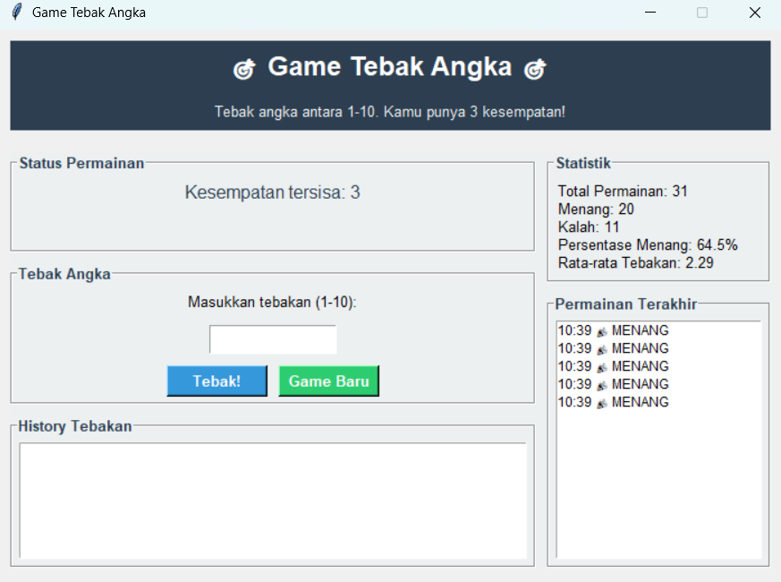
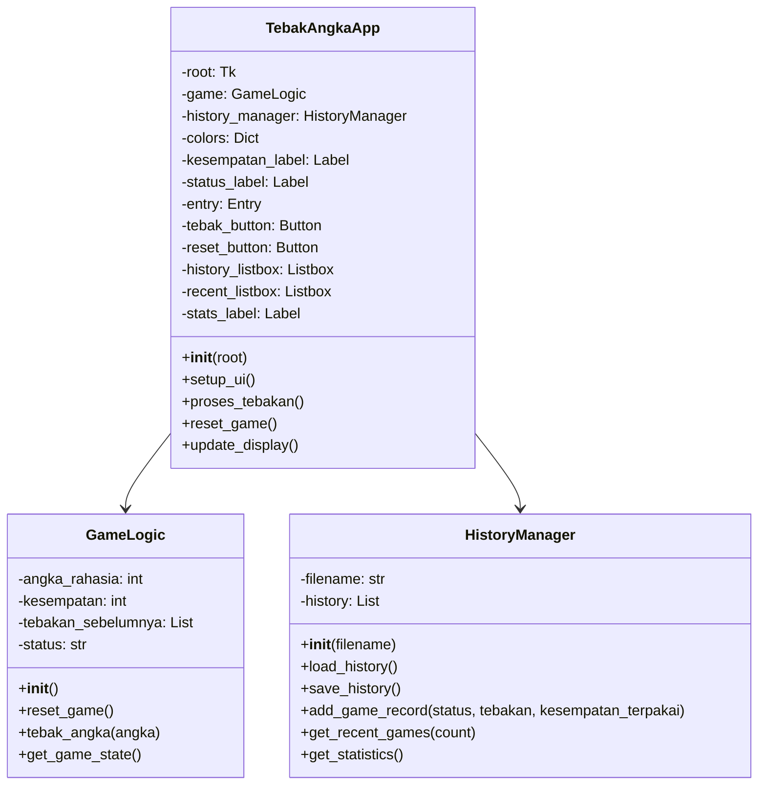
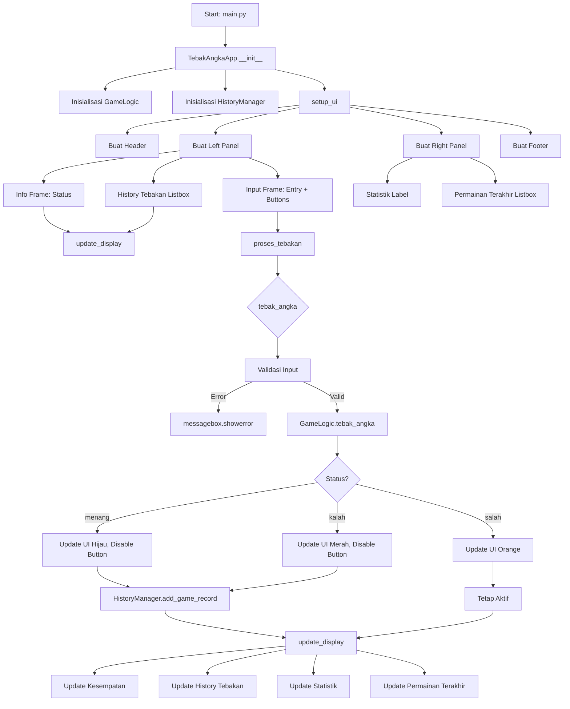

# 🎯 Game Tebak Angka

<div align="center">


**Aplikasi game tebak angka berbasis desktop dengan GUI Tkinter dan penyimpanan riwayat permainan**

</div>

## 📋 Deskripsi Proyek

**Game Tebak Angka** adalah aplikasi permainan sederhana berbasis desktop yang dikembangkan menggunakan Python dan Tkinter untuk antarmuka pengguna. Pemain diminta menebak angka rahasia antara 1 hingga 10 dengan hanya 3 kesempatan. Setiap permainan akan dicatat dalam riwayat, memungkinkan pemain untuk melacak statistik dan performa mereka dari waktu ke waktu.

Fitur utama aplikasi ini:
- **Permainan Tebak Angka**: Tebak angka rahasia (1-10) dengan 3 kesempatan
- **Petunjuk Cerdas**: Petunjuk "lebih besar" atau "lebih kecil" setelah setiap tebakan
- **Riwayat Tebakan**: Daftar semua tebakan dalam permainan berlangsung
- **Statistik Permainan**: Total permainan, jumlah menang/kalah, persentase kemenangan
- **Riwayat Jangka Panjang**: Penyimpanan semua permainan ke file JSON
- **Antarmuka Modern**: Desain dua panel dengan warna tema yang menarik

## 📑 Daftar Isi

- [Deskripsi Proyek](#-deskripsi-proyek)
- [Demo](#-demo)
- [Tampilan Aplikasi](#-tampilan-aplikasi)
- [Latar Belakang](#-latar-belakang)
- [Fitur Utama](#-fitur-utama)
- [Teknologi yang Digunakan](#-teknologi-yang-digunakan)
- [Arsitektur](#-arsitektur)
- [Struktur Proyek](#-struktur-proyek)
- [Cara Instalasi](#-cara-instalasi)
- [Cara Penggunaan](#-cara-penggunaan)
- [Peran Developer](#-peran-developer)
- [Pembelajaran dari Proyek (Lessons Learned)](#-pembelajaran-dari-proyek-lessons-learned)
- [Ucapan Terima Kasih](#-ucapan-terima-kasih)

## 🎮 Demo

(Coming Soon)

## 📸 Tampilan Aplikasi




### Warna Tema

| Elemen | Warna | Kode Hex |
|--------|-------|----------|
| **Primary** | Biru | `#3498db` |
| **Secondary** | Hijau | `#2ecc71` |
| **Danger** | Merah | `#e74c3c` |
| **Warning** | Orange | `#f39c12` |
| **Dark** | Biru Tua | `#2c3e50` |
| **Light** | Abu-abu Muda | `#ecf0f1` |

### Status Permainan

| Status | Warna | Emoji |
|--------|-------|-------|
| **Menang** | Hijau | 🎉 |
| **Kalah** | Merah | 😞 |
| **Salah (petunjuk)** | Orange | - |

## 🎯 Latar Belakang

Proyek ini dibuat sebagai proyek pribadi untuk mengembangkan keterampilan dalam:

- **Pengembangan Aplikasi Desktop dengan Tkinter**: Mempelajari cara membuat antarmuka pengguna yang modern dan responsif
- **Manajemen State**: Mengelola status permainan dengan tiga kondisi (bermain, menang, kalah)
- **Penyimpanan Data dengan JSON**: Menyimpan riwayat permainan untuk analisis jangka panjang
- **Statistik dan Analisis**: Menghitung persentase kemenangan dan rata-rata tebakan

Kebutuhan yang melatarbelakangi proyek ini:
- **Keinginan untuk membuat game sederhana** yang menghibur namun edukatif
- **Eksplorasi Tkinter** untuk membuat antarmuka dengan dua panel
- **Pembelajaran tentang penyimpanan data** menggunakan file JSON
- **Pengembangan portofolio** untuk menunjukkan kemampuan Python dan Tkinter

## 🌟 Fitur Utama

### 🎮 **Game Logic**

| Fitur | Deskripsi | Implementasi |
|-------|-----------|--------------|
| **Angka Rahasia** | Angka acak 1-10 setiap permainan | `random.randint(1, 10)` |
| **Kesempatan Terbatas** | Hanya 3 kesempatan menebak | `self.kesempatan = 3` |
| **Petunjuk Cerdas** | "Lebih besar" atau "lebih kecil" | `"lebih kecil" if angka > angka_rahasia else "lebih besar"` |
| **Status Permainan** | "bermain", "menang", "kalah" | `self.status` |
| **Riwayat Tebakan** | Menyimpan semua tebakan | `self.tebakan_sebelumnya.append(angka)` |

### 📊 **Statistik dan Riwayat**

| Fitur | Deskripsi | Implementasi |
|-------|-----------|--------------|
| **Total Permainan** | Jumlah semua permainan | `len(self.history)` |
| **Jumlah Menang/Kalah** | Hitung kemenangan dan kekalahan | `sum(1 for game in history if game["status"] == "menang")` |
| **Persentase Menang** | (Menang / Total) × 100% | `(menang / total_game) * 100` |
| **Rata-rata Tebakan** | Rata-rata jumlah tebakan per game | `sum(total_tebakan) / total_game` |
| **Permainan Terakhir** | 5 permainan terbaru | `history[-5:]` |

### 💾 **Penyimpanan JSON**

Struktur data dalam `history_tebak_angka.json`:
```json
{
  "tanggal": "2025-11-05 23:21:11",
  "status": "kalah",
  "tebakan": [10, 5, 2],
  "kesempatan_terpakai": 3,
  "total_tebakan": 3
}
```

### 🎨 **Antarmuka Pengguna**

| Panel | Komponen | Fungsi |
|-------|----------|--------|
| **Header** | Label judul dan subtitle | Informasi game |
| **Left Panel** | Status, input, history tebakan | Area bermain utama |
| **Right Panel** | Statistik, permainan terakhir | Informasi dan analisis |
| **Footer** | Label copyright | Informasi tambahan |

## 🛠️ Teknologi yang Digunakan

### Core Technologies

| Teknologi | Fungsi | Alasan Penggunaan |
|-----------|--------|-------------------|
| **Python 3.7+** | Bahasa pemrograman utama | Mudah dipelajari, library melimpah |
| **Tkinter** | GUI Framework | Library bawaan Python, mudah digunakan |
| **JSON** | Data Storage | Format ringan untuk riwayat permainan |
| **Random** | Number generation | Membuat angka rahasia acak |
| **Datetime** | Timestamp | Mencatat waktu permainan |

### Library yang Digunakan

| Library | Fungsi | Penggunaan |
|---------|--------|------------|
| **tkinter** | GUI components | `Tk`, `Frame`, `Label`, `Entry`, `Button`, `Listbox` |
| **tkinter.ttk** | Themed widgets | (opsional, beberapa menggunakan tk standar) |
| **random** | Random number | `randint(1, 10)` untuk angka rahasia |
| **json** | Data persistence | Menyimpan/memuat riwayat permainan |
| **datetime** | Timestamp | `datetime.now().strftime()` untuk waktu |
| **os** | File checking | `os.path.exists()` untuk cek file |

## 🏗️ Arsitektur

### Diagram Kelas



### Diagram Alur Aplikasi



### Diagram Alur Game Logic

```mermaid
graph TD
    A[reset_game] --> B[angka_rahasia = random(1-10)]
    B --> C[kesempatan = 3]
    C --> D[tebakan_sebelumnya = []]
    D --> E[status = "bermain"]
    
    F[tebak_angka(angka)] --> G{status == "bermain"?}
    G -->|Tidak| H[Return status selesai]
    
    G -->|Ya| I{1 <= angka <= 10?}
    I -->|Tidak| J[Return error]
    
    I -->|Ya| K[tebakan_sebelumnya.append(angka)]
    K --> L{angka == angka_rahasia?}
    
    L -->|Ya| M[status = "menang"]
    M --> N[Return menang]
    
    L -->|Tidak| O[kesempatan -= 1]
    O --> P{kesempatan == 0?}
    
    P -->|Ya| Q[status = "kalah"]
    Q --> R[Return kalah]
    
    P -->|Tidak| S[Return salah dengan petunjuk]
```

### Penjelasan File

| File | Fungsi |
|------|--------|
| **main.py** | Entry point aplikasi. Menginisialisasi Tkinter root dan menjalankan aplikasi. |
| **game_logic.py** | Berisi class `GameLogic` yang mengelola logika permainan: angka rahasia, kesempatan, validasi tebakan, dan status permainan. |
| **gui.py** | Berisi class `TebakAngkaApp` yang membangun antarmuka pengguna dengan Tkinter. Menangani input, tombol, dan update tampilan. |
| **history_manager.py** | Berisi class `HistoryManager` untuk menyimpan, memuat, dan menganalisis riwayat permainan ke/dari file JSON. |
| **history_tebak_angka.json** | File JSON yang menyimpan semua riwayat permainan. Dibuat otomatis saat pertama kali menyimpan. |


## 📥 Cara Instalasi

### Prasyarat

- **Python 3.7 atau lebih tinggi** - [Download Python](https://www.python.org/downloads/)
- **Tkinter** - Biasanya sudah termasuk dalam instalasi Python

### Langkah-langkah Instalasi

1. **Clone Repository**
   ```bash
   git clone https://github.com/Chrisimana/game-tebak-angka.git
   cd game-tebak-angka
   ```

2. **Buat Virtual Environment (Opsional)**
   ```bash
   # Windows
   python -m venv venv
   venv\Scripts\activate
   
   # Linux/Mac
   python3 -m venv venv
   source venv/bin/activate
   ```

3. **Jalankan Aplikasi**
   ```bash
   python src/main.py
   ```

## 🎮 Cara Penggunaan

### Menjalankan Aplikasi

```bash
python src/main.py
```

### Cara Bermain

1. **Mulai Permainan**
   - Program akan secara otomatis menghasilkan angka rahasia antara 1-10
   - Anda memiliki 3 kesempatan untuk menebak

2. **Menebak Angka**
   - Masukkan tebakan Anda di kolom input (angka 1-10)
   - Klik tombol **"Tebak!"** atau tekan **Enter**
   - Setiap tebakan akan dicatat di panel "History Tebakan"

3. **Petunjuk**
   - Jika tebakan terlalu besar: "Coba angka yang lebih kecil"
   - Jika tebakan terlalu kecil: "Coba angka yang lebih besar"

4. **Akhir Permainan**
   - **Menang**: Jika tebakan Anda benar
   - **Kalah**: Jika 3 kesempatan habis

5. **Game Baru**
   - Klik tombol **"Game Baru"** untuk memulai permainan baru
   - Angka rahasia baru akan di-generate

### Memahami Antarmuka

| Area | Komponen | Fungsi |
|------|----------|--------|
| **Header** | Judul & Subtitle | Informasi game dan aturan main |
| **Status Permainan** | Label kesempatan & status | Menampilkan sisa kesempatan dan umpan balik |
| **Input Area** | Entry + Tombol Tebak | Tempat memasukkan tebakan |
| **Game Baru** | Tombol Reset | Memulai permainan baru |
| **History Tebakan** | Listbox | Daftar semua tebakan di game ini |
| **Statistik** | Label | Total game, menang/kalah, persentase |
| **Permainan Terakhir** | Listbox | 5 game terakhir dengan status dan waktu |

### Statistik yang Ditampilkan

| Statistik | Rumus | Contoh |
|-----------|-------|--------|
| **Total Permainan** | Jumlah semua game | `Total Permainan: 10` |
| **Menang** | Jumlah game menang | `Menang: 6` |
| **Kalah** | Jumlah game kalah | `Kalah: 4` |
| **Persentase Menang** | (Menang / Total) × 100 | `Persentase Menang: 60.0%` |
| **Rata-rata Tebakan** | Total tebakan / Total game | `Rata-rata Tebakan: 2.1` |

### Tips Bermain

1. **Gunakan petunjuk**: Setiap tebakan memberi petunjuk "lebih besar" atau "lebih kecil"
2. **Strategi pencarian biner**: Mulai dengan angka 5, lalu sesuaikan berdasarkan petunjuk
3. **Catat tebakan**: History tebakan membantu Anda tidak mengulang angka yang sama
4. **Analisis statistik**: Lihat persentase kemenangan untuk mengukur performa

## 👨‍💻 Peran Developer

### Peran dalam Proyek

| Area | Kontribusi |
|------|------------|
| **Perencanaan** | Merancang fitur-fitur game tebak angka dengan 3 kesempatan |
| **Game Logic** | Implementasi class `GameLogic` untuk logika permainan |
| **GUI Development** | Membangun antarmuka dengan Tkinter (dua panel, warna tema) |
| **Data Management** | Implementasi class `HistoryManager` untuk penyimpanan JSON |
| **Statistik** | Menghitung dan menampilkan statistik permainan |
| **UI/UX Design** | Mendesain tampilan dengan warna tema yang konsisten |
| **Event Handling** | Binding event untuk tombol dan Enter key |
| **Error Handling** | Validasi input dengan messagebox |

### Fokus Pengembangan

1. **Fungsionalitas Inti**
   - Game logic dengan 3 kesempatan
   - Petunjuk "lebih besar/lebih kecil"
   - Validasi input (angka 1-10)

2. **User Experience**
   - Antarmuka dua panel yang intuitif
   - Warna berbeda untuk setiap status
   - Feedback visual dengan emoji
   - Shortcut Enter untuk tebak

3. **Data dan Analisis**
   - Penyimpanan riwayat jangka panjang
   - Statistik real-time
   - Riwayat 5 game terakhir

## 📚 Pembelajaran dari Proyek (Lessons Learned)

### Keterampilan Teknis yang Diperoleh

1. Tkinter Layout Management
2. Dynamic UI Updates
3. Game State Management
4. JSON Data Persistence
5. Statistik Calculation
6. Event Binding
7. Error Handling


### Soft Skills yang Dikembangkan

#### 1. **Problem Decomposition**
- Memecah aplikasi menjadi komponen: game logic, GUI, history manager
- Memisahkan tanggung jawab ke dalam class berbeda
- Mendesain UI dengan panel-panel terpisah

#### 2. **User-Centered Design**
- Memikirkan pengguna akhir dengan antarmuka yang intuitif
- Warna berbeda untuk setiap status
- Shortcut Enter untuk kemudahan penggunaan
- Emoji untuk feedback visual

#### 3. **Code Organization**
- Struktur kode yang rapi dengan class terpisah
- Naming convention yang konsisten
- Pemisahan konfigurasi warna

#### 4. **Testing and Debugging**
- Menguji dengan berbagai skenario input
- Menangani edge cases (angka di luar range, input kosong)
- Validasi input dengan messagebox


## 🙏 Ucapan Terima Kasih

### Sumber Daya dan Referensi

#### Dokumentasi Resmi
- [Python Documentation](https://docs.python.org/3/) - Bahasa pemrograman
- [Tkinter Documentation](https://docs.python.org/3/library/tkinter.html) - GUI framework
- [JSON Documentation](https://www.json.org/json-en.html) - Data format

#### Tools yang Membantu
- **GitHub** - Hosting repository dan version control
- **Visual Studio Code** - Editor kode
- **Shields.io** - Badges untuk README
- **Mermaid.js** - Diagram alur

---

<div align="center">

**⭐ Jika proyek ini menarik atau bermanfaat, berikan bintang! ⭐**

**"Menebak angka itu mudah, menebak kode itu tantangan - sama seperti coding"**

</div>